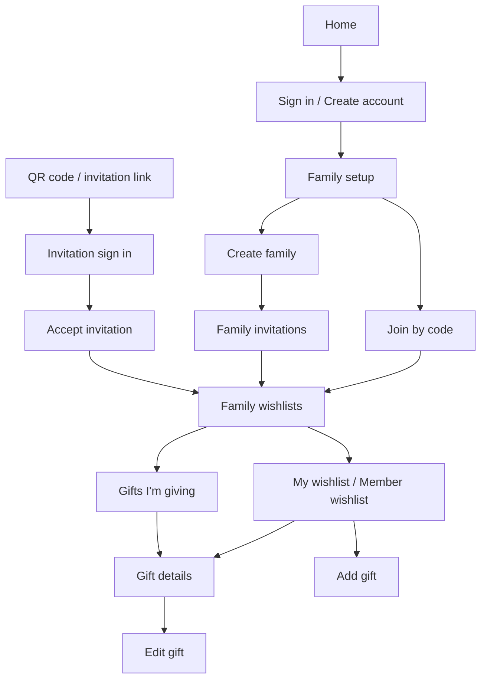

# Pukki sitemap

Use the screen names below when requesting changes, for example "Add a search field to Family wishlists" or "Change the Join invitation screen." These names describe the current app, including views that share a URL.

Routes below use English. Finnish uses the same routes with `/fi` in front, such as `/fi/family`. `uid` is an account ID and `gid` is a gift ID. The language buttons retain the current route and invitation code.

## Screens

| Name | Route | When it appears and what it does | Source under `frontend/` |
| --- | --- | --- | --- |
| Home | `/` | Shows Sign in when signed out, family setup when signed in without a family, or Family wishlists when membership exists. | `pages/index.js` |
| Sign in | `/login`, or `/` signed out | Username and password form. Switches to Create account. | `pages/login.js` |
| Create account | Same as Sign in, after choosing Create an account | Username, password, and matching password confirmation. Immediate signup with no email confirmation. Continues to family setup, or returns to an invitation if a code is present. | `pages/login.js` |
| Request password reset | `/forgot-password` | Email form opened by Forgot password. Shared input and 46px button. Submission is disabled until SendGrid and the Express reset endpoint are connected. Preserves invitation codes when returning to Sign in. | `pages/forgot-password.js` |
| Check your email | `/forgot-password?preview=sent`, development only | Preview of the generic reset-link confirmation, with Sign in and Use a different email actions. Does not send email. | `pages/forgot-password.js` |
| New password | `/reset-password` | New password and confirmation fields. Submission is disabled until reset-token validation and password updates are connected. | `pages/reset-password.js` |
| Password updated | `/reset-password?preview=complete`, development only | Preview of reset success and the Sign in action. Does not change passwords. | `pages/reset-password.js` |
| Reset link expired | `/reset-password?preview=expired`, development only | Preview with a Request new link button. | `pages/reset-password.js` |
| Family setup | `/family`, or `/` without membership | Two buttons: Create family or Join family. Each opens its form. | `components/Family/Family.js` |
| Create family | `/family`, after choosing Create family | Enter a family name. Creating it makes the account its first member and opens Family invitations. Back returns to Family setup. | `components/Family/Family.js` |
| Join by code | `/family`, after choosing Join family | Enter an six-character family code. Successful joins open Family wishlists immediately. Back returns to Family setup. | `components/Family/Family.js` |
| Invitation signup / sign in | `/join?code=CODE`, signed out | Shows the family's name, fireplace and decorations, and invitation message. Defaults to Create account, with Sign in available for existing users. Preserves the invitation code through either form. | `pages/join.js`, `pages/login.js` |
| Accept invitation | `/join?code=CODE`, signed in without membership | Shows the invited family's name and a short message. Join opens Family wishlists after accepting; Not now returns to Family setup. Missing or invalid invitations show a short error. No code entry or automatic join. | `pages/join.js`, `components/Family/Invitation.js` |
| Already in a family | `/join?code=CODE`, when membership exists | For the same family, offers Open family. For another family, explains the existing membership and offers Go to my family. Does not move the account. | `components/Family/Invitation.js` |
| Family invitations | `/family`, when membership exists | Family name, short code, QR code, copy buttons, and invitation link. Normal visits show Back at the top left, returning to Family wishlists. Immediately after creation, `/family?created=1` shows Let's go! instead. Available to every family member. | `components/Family/Family.js` |
| Family wishlists | `/users`, or `/` with membership | Lists family members and their wishlists, with links to My wishlist, Gifts I'm giving, and Family invitations. | `pages/users.js` |
| My wishlist | `/users/:uid`, where `uid` is the signed-in account | Own gifts and Add gift action. Claim information is hidden from the recipient. | `pages/users/[uid].js` |
| Avatar picker | Modal on any signed-in screen | Open the header avatar to choose from 21 custom avatars. Selecting one saves it and closes the modal. Nearly full screen on mobile. | `components/AvatarPicker/AvatarPicker.js` |
| Member wishlist | `/users/:uid`, for another member of the same family | Member's gifts, including claim status visible to other members. | `pages/users/[uid].js` |
| Add gift | `/users/:uid/gift` | Form for name, description, and optional product URL. Only the account's own wishlist can be edited. | `pages/users/[uid]/gift.js` |
| Edit gift | `/users/:uid/:gid/edit` | Existing gift form. Owner-only; saves back to the wishlist. | `pages/users/[uid]/[gid]/edit.js`, `pages/users/[uid]/gift.js` |
| My gift | `/users/:uid/:gid`, owned by the account | Gift details, Edit and Delete actions. Does not reveal who claimed it. | `pages/users/[uid]/[gid].js` |
| Delete gift confirmation | Modal on My gift | Shows the gift name with Cancel and Delete. Cancel or Escape closes without deleting. Confirming shows the candy-cane loader, then returns to the wishlist. | `components/ConfirmDialog/ConfirmDialog.js` |
| Available gift | `/users/:uid/:gid`, another member's unclaimed gift | Gift details and claim action. | `pages/users/[uid]/[gid].js` |
| Gift claimed by me | `/users/:uid/:gid`, claimed by the account | Gift details and release-claim action. | `pages/users/[uid]/[gid].js` |
| Gift claimed by someone else | `/users/:uid/:gid`, claimed by another member | Gift details and claimant information; no release action. | `pages/users/[uid]/[gid].js` |
| Gifts I'm giving | `/gifts` | Gifts the account has claimed. Opens gift details with `?from=shopping` so Back returns here. | `pages/gifts.js` |
| Privacy | `/privacy` | Public privacy notice. | `pages/privacy.js` |
| About | `/about` | Short introduction to Pukki with Christmas artwork. Public; linked to the left of Privacy in the footer. | `pages/about.js` |
| Delete-data request | `/delete` | Public email link requesting data deletion. It does not delete anything automatically. | `pages/delete.js` |
| Not found | Unknown routes, or `/404` | Route-not-found message. Missing/inaccessible gifts use an inline error on the gift route. | `pages/404.js` |

## Shared states and navigation

Local invitation review links use `/join?preview=accept`, `signin`, `signup`, `joined`, `other-family`, or `invalid`. These development-only previews use the example family The Johnsons. Submitting preview forms only switches preview screens; it never creates an account or changes membership. Sign-in and signup previews hide the current session in the UI without signing out.

- Session loading: a loader appears before account-dependent screens render. A failed session request shows an error and Try again.
- Data loading: family members and gifts share an in-memory SWR cache scoped to the signed-in account and family. Wishlist, gift detail, editing, and shopping views reuse it. Screens show cached content immediately, then fetch fresh data client-side and update in place. Requests within two seconds are deduplicated. Focus and reconnect also refresh in the background; successful gift writes update the shared snapshot immediately. Invitation data and likely page bundles are prefetched. The candy-cane loader appears when required data is missing, not on every navigation.
- Signed out: opening `/family`, `/users`, any nested user route, or `/gifts` redirects to Sign in.
- No family: opening wishlist or shopping routes redirects to Family setup to choose Create family or Join family.
- Empty lists: Family wishlists shows an invitation prompt when alone; wishlists and Gifts I'm giving show their empty-state banners.
- Failed loads and mutations: errors appear within the current screen. Form buttons retain their labels and are disabled during submission.
- Shared shell: Sign out when authenticated, decorative Christmas artwork, countdown, English/Finnish buttons, and Privacy link.
- Password recovery screens are UI-only pending SendGrid, account email storage, and Express reset endpoints. There are no separate screens for profile settings, leaving a family, removing members, or rotating invitation codes yet.

## Main flows

Express `/v1/*` endpoints are API routes, not screens. Next.js serves the screens; Express enforces access to all account and family data.
